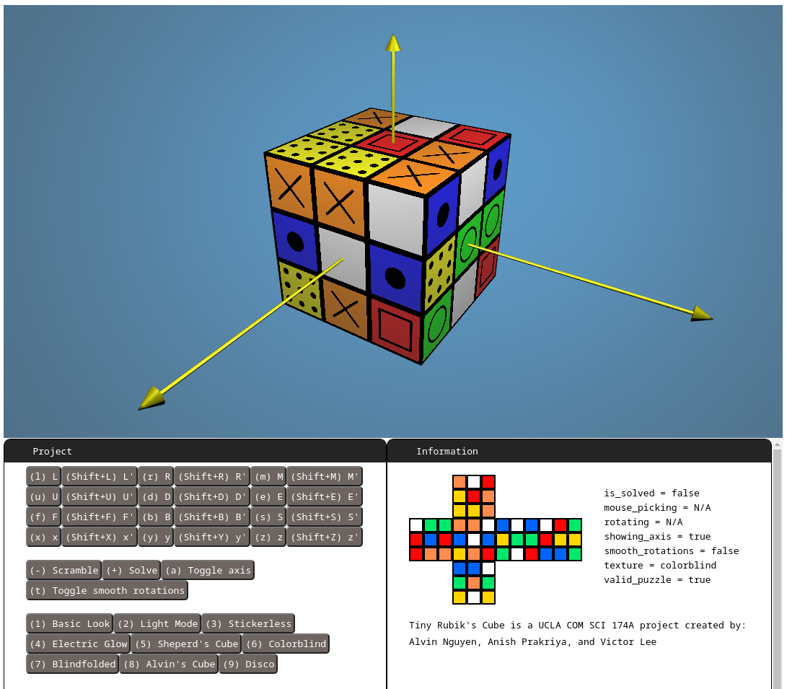

# Tiny Rubik's Cube

A highly configurable online Rubiks's Cube built using the [Tiny Graphics WebGL Library](https://github.com/encyclopedia-of-code/tiny-graphics-js).



To run locally this program, you'll need to install [Python](https://www.python.org/) beforehand. Then, download the files, navigate to the folder containing these files, and run

```bash
python server.py
```

You should be able to access the program on `localhost:8000`.

## Features

Upon loading the web page, you'll find a recreation of the the world's bestselling puzzle game. You can press certain keys to move the Rubik's Cube using the popular [Singmaster Notation](https://ruwix.com/the-rubiks-cube/notation/).

* Pressing `f` (Front) turns the side currently facing the solver;
* Pressing `b` (Back) turns the side opposite the front;
* Pressing `u` (Up) turns the side above or on top of the front side;
* Pressing `d` (Down) turns the side opposite the top, underneath the Cube;
* Pressing `l` (Left) turns the side directly to the left of the front;
* Pressing `r` (Right) turns the side directly to the right of the front;
* Pressing `m` (Middle) turns the layer between *L* and *R*, in the direction of *L*;
* Pressing `e` (Equator) turns the layer between *U* and *D*, in the direction of *D*;
* Pressing `s` (Standing) turns the layer between *F* and *B*, in the direction of *F*;
* Pressing `x` (x-Axis) rotates the entire Cube on *R*;
* Pressing `y` (y-Axis) rotates the entire Cube on *U*;
* Pressing `z` (z-Axis) rotates the entire Cube on *F*.

To make a counterclockwise move, press `Shift` before the desired move key.

Alternatively, you can use the mouse to move the Cube. This functionality was implemented using **mouse picking**. Whenever the mouse is clicked, a 3-D ray is projected from the mouse, through the camera, into the scene. The program then computes the intersection point between the Cube's faces and the ray (if any). The difference between the points obtained from a mouse press and subsequent mouse release is used to determine which way the Cube should turn.

Tiny Rubik's Cube includes a host of other features. For instance, there are buttons to solve and scramble the Rubik's Cube. Axis arrows can be toggled on/off by pressing `a`. Smooth rotations can also be toggled on/off by pressing `t`. If you are bored with the current look of the cube, you can change it's textures by pressing the number keys from `1` to `9`. Last but not least, you can change the Cube's sticker colors by pressing the buttons on the flat diagram.
